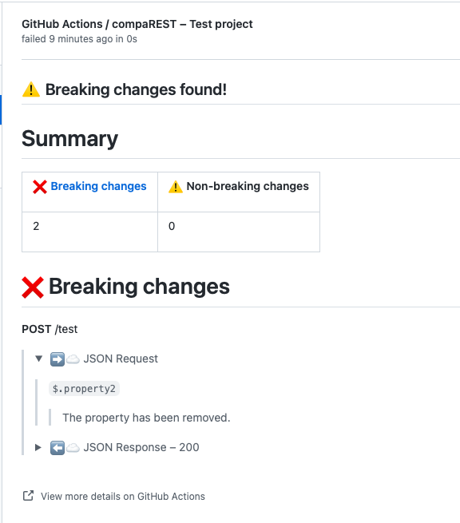

# CompaREST

[](https://hackage.haskell.org/package/comparest)
[](http://stackage.org/lts/package/comparest)
[](http://stackage.org/nightly/package/comparest)
[](LICENSE)

Compatibility checker for OpenAPI

## Using compaREST in Github Actions

Add the following step to your  Github Actions workflow:

```yaml
- uses: typeable/comparest
    if: ${{ github.event_name == 'pull_request' }}
    with:
      old: old-openapi.yaml
      new: new-openapi.yaml
```

The `new` and `old` values should be paths to your OpenAPI specifications you want to compare.

You will get something like this in your pull requests:



For more detail please see our [integration guide](docs/Integration_guide.md).

## An example

### Your situation

You are developing a very important server with a REST API. You have clients who use your API that you do not control. Say, you are also developing a mobile app that uses your API and you can't force someone to update to the latest version. (Or you prefer not to for UX reasons.)

You have recently released version 1.0 and things are going great: user are downloading your app, servers are processing requests.

You describe your API in a file `api-1.0.0.yaml`:

```yaml
openapi: "3.0.0"
info:
  version: 1.0.0
  title: Swagger Petstore
  license:
    name: MIT
servers:
  - url: https://example.com
paths:
  /pets:
    get:
      parameters:
        - name: limit
          in: query
          required: false
          schema:
            type: integer
            maximum: 20
      responses:
        "200":
          description: ""
          headers:
            x-next:
              schema:
                type: string
          content:
            application/json:
              schema:
                $ref: "#/components/schemas/Pets"
    post:
      requestBody:
        content:
          application/json:
            schema:
              $ref: "#/components/schemas/Pet"
      responses:
        "201":
          description: ""
components:
  schemas:
    Pet:
      type: object
      required:
        - id
        - name
      properties:
        id:
          type: integer
        name:
          type: string
          minLength: 3
          maxLength: 10
    Pets:
      type: array
      items:
        $ref: "#/components/schemas/Pet"
```

### Evolving your product

Enthused over your initial success you hurry to release a new and improved version of your API and mobile app.

After a round of very intense programming you take a look at your new `api-1.1.0.yaml`:

```yaml
openapi: "3.0.0"
info:
  version: 1.1.0
  title: Swagger Petstore
  license:
    name: MIT
servers:
  - url: https://example.com
paths:
  /pets:
    get:
      parameters:
        - name: limit
          in: query
          required: false
          schema:
            type: integer
            maximum: 30
      responses:
        "200":
          description: ""
          headers:
            x-next:
              schema:
                type: string
          content:
            application/json:
              schema:
                $ref: "#/components/schemas/Pets"
    post:
      requestBody:
        content:
          application/json:
            schema:
              $ref: "#/components/schemas/Pet"
      responses:
        "201":
          description: ""
components:
  schemas:
    Pet:
      type: object
      required:
        - id
        - name
      properties:
        id:
          type: integer
        name:
          type: string
          minLength: 1
          maxLength: 15
        weight:
          type: integer
    Pets:
      type: array
      items:
        $ref: "#/components/schemas/Pet"
```

Looking at the very large and complex API description, you grow more and more concerned that your old mobile app might stop working when you update the server. But the spec is too large and too complex to reasonably assess this manually.

### Assessing compatibility automatically

Luckily, you have access to compaREST which can programmatically analyze your APIs and determine what, if anything, breaks compatibility and what doesn't.

You can call it, passing the API your client will be aware of, and the API your server will serve like so:

```bash
docker run --rm -v $(pwd):/data:rw typeable/comparest --client /data/api-1.0.0.yaml --server /data/api-1.1.0.yaml --output /data/report.md
```

Running this command will output a file `report.md`, containing the compatibility report between the two APIs:

> # Summary
>
> | [❌ Breaking changes](#breaking-changes) | [⚠️ Non-breaking changes](#non-breaking-changes) |
> |------------------------------------------|--------------------------------------------------|
> | 5                                        | 6                                                |
>
> # <span id="breaking-changes"></span>❌ Breaking changes
>
> ## **GET** /pets
>
> ### ⬅️☁️ JSON Response – 200
>
> #### `$[*].name(String)`
>
> 1.  Maximum length of the string changed from 10 to 15.
>
> 2.  Minimum length of the string changed from 3 to 1.
>
> ## **POST** /pets
>
> ### ➡️☁️ JSON Request
>
> #### `$.weight`
>
> 1.  Values are now limited to the following types:
>
>     -   Number
>
> 2.  The property was previously implicitly described by the catch-all
>     "additional properties" case. It is now explicitly defined.
>
> #### `$.weight(Number)`
>
> Value is now a multiple of 1.0.
>
> # <span id="non-breaking-changes"></span>⚠️ Non-breaking changes
>
> ## **GET** /pets
>
> ### Parameter limit
>
> #### JSON Schema
>
> ##### `$(Number)`
>
> Upper bound changed from 20.0 inclusive to 30.0 inclusive.
>
> ### ⬅️☁️ JSON Response – 200
>
> #### `$[*].weight`
>
> 1.  Values are now limited to the following types:
>
>     -   Number
>
> 2.  The property was previously implicitly described by the catch-all
>     "additional properties" case. It is now explicitly defined.
>
> #### `$[*].weight(Number)`
>
> Value is now a multiple of 1.0.
>
> ## **POST** /pets
>
> ### ➡️☁️ JSON Request
>
> #### `$.name(String)`
>
> 1.  Maximum length of the string changed from 10 to 15.
>
> 2.  Minimum length of the string changed from 3 to 1.

You now know exactly in what situations and in what way your 1.0 version of the app will break if you deploy your 1.1 version of the server.

### Additional formats

You can also produce a self-contained HTML report that you can open in your browser by simply omitting the file extension of the output file:

```bash
docker run --rm -v $(pwd):/data:rw typeable/comparest --client /data/api-1.0.0.yaml --server /data/api-1.1.0.yaml --output /data/report
```

## CLI docs

For more detail please see our [user guide](docs/User_guide.md).

```
Usage: comparest (-c|--client ARG) (-s|--server ARG)
                 [--silent | --only-breaking | --all] [-o|--output ARG]
                 [--folding-block-quotes-style | --header-style]
                 [--signal-exit-code]
  A tool to check compatibility between two OpenAPI specifications.

  Usage examples

      Compare files old.yaml with new.yaml and output the resulting report to
      stdout:

          comparest -c old.yaml -s new.yaml

      Only output breaking changes and write a styled HTML report to file
      report.html:

          comparest -c old.yaml -s new.yaml --only-breaking -o report

      Don't output anything, only fail if there are breaking changes:

          comparest -c old.json -s new.json --silent

      Write full report suitable for embedding into a GitHub comment to
      report.html:

          comparest -c old.json -s new.json --folding-block-quotes-style -o report.html

Available options:
  -h,--help                Show this help text
  -c,--client ARG          A path to the file containing the specification that
                           will be used for the client of the API. Can be either
                           a YAML or JSON file.
  -s,--server ARG          A path to the file containing the specification that
                           will be used for the server of the API. Can be either
                           a YAML or JSON file.
  --silent                 Silence all output. Only makes sense in combination
                           with --signal-exit-code.
  --only-breaking          Only report breaking changes in the output.
  --all                    Report both incompatible and compatible changes.
                           Compatible changes will not trigger a failure exit
                           code.
  -o,--output ARG          The file path where the output should be written. If
                           the option is omitted the result will be written to
                           stdout.

                           The file extension is used to determine the type of
                           the output file.

                           Supports many formats such as markdown, html, rtf,
                           doc, txt, rst, and many more.

                           Leave out the extension to produce a self-contained
                           HTML report with styling.
  --folding-block-quotes-style
                           The report tree is structured using summary/detail
                           HTML elements and indented using block quotes. This
                           style renders well on GitHub.Intended for HTML output
                           format. Markdown has rendering bugs on GitHub.
  --header-style           The report tree is structured using increasing levels
                           of headers.
  --signal-exit-code       Signal API compatibility with the exit code.

                           Exit with 0 if there are no breaking changes.
                           Exit with 1 if there are breaking changes.
                           Exit with 2 if could not determine compatibility.
```
