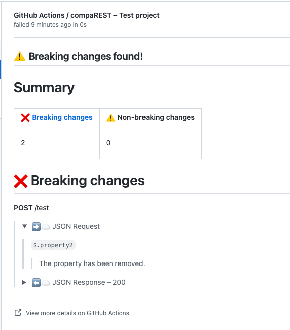

# Integration guide

## Github Actions

In cases where your OpenAPI spec can be generated from your code, it can be useful to see how a pull request changes your API. For this very purpose we have a Github Action.

### Generating the inputs

To use it you need to first get the old (before the pull request) and new (after the pull request) specs.

For example:

- To get the old spec you can:
  - Download from a public "production" server (if your api is public and you provide an OpenAPI spec)
  - Checkout the base commit of the pull request and generate is programmatically.

    You can checkout the base commit like so in Github Actions:

    ```bash
    git checkout $(git merge-base ${{ github.event.pull_request.head.sha }} ${{ github.event.pull_request.base.sha }})
    ```
- To get the new spec you can:
  - Build and run the spec generation for the head commit of the pull request

### Run the action

In our example we have already generated the two OpenAPI specs and placed them in the `old-openapi.yaml` and `new-openapi.yaml` files.

We can now run our action:

##### NOTE: will only work after public release

```yaml
- uses: typeable/comparest
    with:
      old: old-openapi.yaml
      new: new-openapi.yaml
      project_name: TEST
```

This will create a check on the pull request displaying the changes (if there are any) similar to this:



The check will show success when there are no breaking changes, and be neutral otherwise.

## Integrating into something other than Github Actions

We have a dedicated implementation only for Github Actions. However, we provide a generic CLI which can be used to integrate compaREST into arbitrary workflows and CI systems.

You see an example of CLI usage in our [readme](../README.md#assessing-compatibility-automatically).
