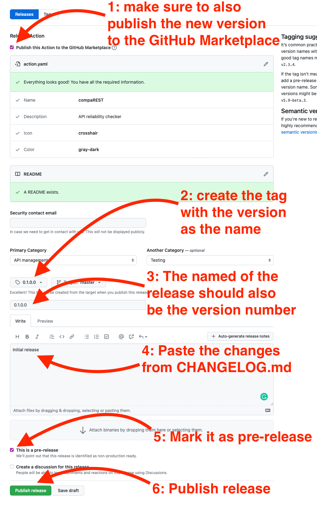
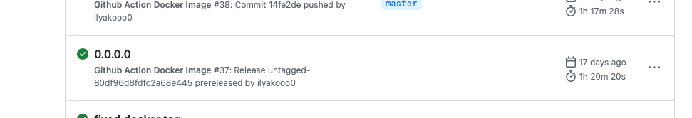
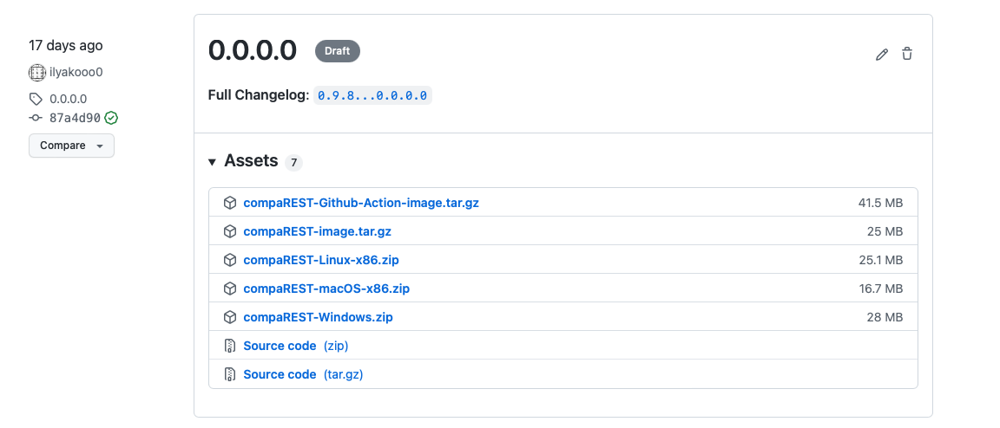

# The release procedure

1. Update the version number everywhere:
   1. Version in [compaREST.cabal](../compaREST.cabal)
   2. Docker tag in [action.yaml](../action.yaml)
   3. Set the version of unreleased changes in [CHANGELOG.md](../CHANGELOG.md)
2. Publish!
   1. Create a pre-release on GitHub:
      
   2. This will automatically start the release procedure. You can check the state of it in the "Actions" tab on GitHub:
      
   3. If everything goes as planned, the release action should pass and all assets should be added to the release:
      
   4. The new version should be automatically uploaded a release candidate to [Hackage](https://hackage.haskell.org/package/compaREST/candidates/). Make sure everything looks okay and publish it.
   5. Go to the Releases tab on GitHub and edit the release to make it not a "pre-release".
